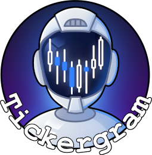
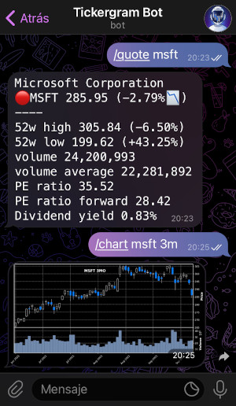
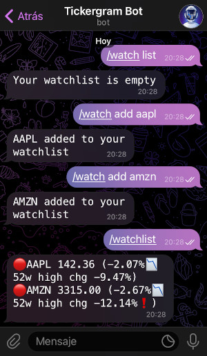

## What's Tickergram?

Tickergram is a Telegram bot to look up quotes, charts, general market sentiment and more. It can be used collaboratively in group chats or by talking directly to it. Users can also keep a watchlist and receive price information notifications.

## Supporting Tickergram

I maintain an instance of Tickergram running at [@tickergrambot](https://t.me/tickergrambot). By becoming a sponsor, you will support the project and get access to this bot instance. Check the [sponsor](https://github.com/sponsors/a0rtega) tiers for more information.

<p align="center">
  
  
</p>

Or continue reading and get your own instance running in no time!

## Requirements

- Python 3.9+
- Python requirements, most notably [yfinance](https://github.com/ranaroussi/yfinance), which is used to get financial information. The data provider may change in the future.
- [Redis](https://redis.io/), used as database to keep both permanent and temporary data (cache).
- (_Optional_) Firefox is used by bot commands that take website screenshots, such as `/feargreed`.

## Installation

- Talk to the [@BotFather](https://t.me/botfather) to create a new bot and get its token.
- Install Redis.
- Install Tickergram and its dependencies by running `python setup.py install`.
- Run the bot with the assistance of the self-explanatory help message:

```
$ tickergram-bot -h
usage: tickergram-bot [-h] [-p PASSWORD] [-r REDIS] [-l PORT] [-d DB] token

Tickergram bot

positional arguments:
  token                 Telegram Bot API token

optional arguments:
  -h, --help            show this help message and exit
  -p PASSWORD, --password PASSWORD
                        Optional password needed to interact with the bot (enables the /auth command)
  -r REDIS, --redis REDIS
                        redis host to use
  -l PORT, --port PORT  redis port to use
  -d DB, --db DB        redis database to use
```

If Tickergram is running correctly, the output should be similar to this:

```
$ tickergram-bot <token>
2021-09-28 19:52:58,820 Checking Telegram API token ...
2021-09-28 19:52:58,942 Telegram API token is valid
2021-09-28 19:52:58,942 Testing Redis connectivity ...
2021-09-28 19:52:58,944 Redis connection is ok
2021-09-28 19:52:58,946 Bot is running with pid 116526
```

## Usage

After sending the Telegram message `/start` or `/help` to the bot, it will reply with the supported bot commands.

The bot administrator can notify chat watchlists (when notifications are enabled) with the command `tickergram-notify`. It may be a good idea to run this command on a regular basis (for example at market open) using crontab.

## Author

Alberto Ortega

## License

[MIT](LICENSE)
